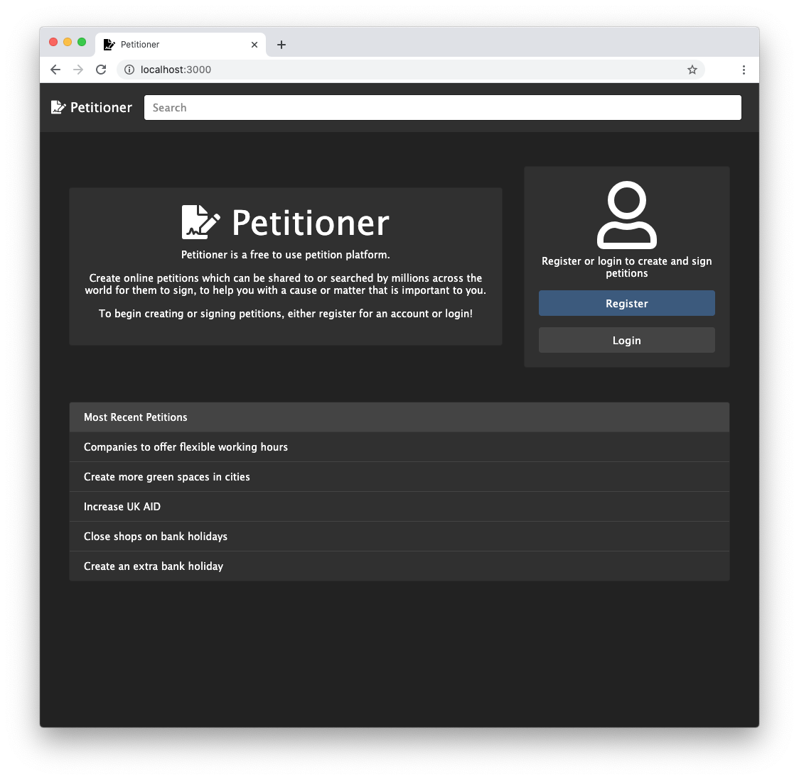
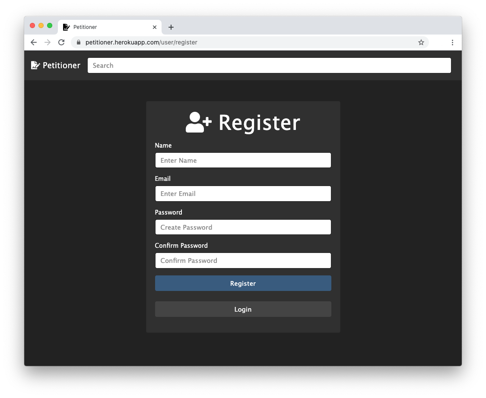
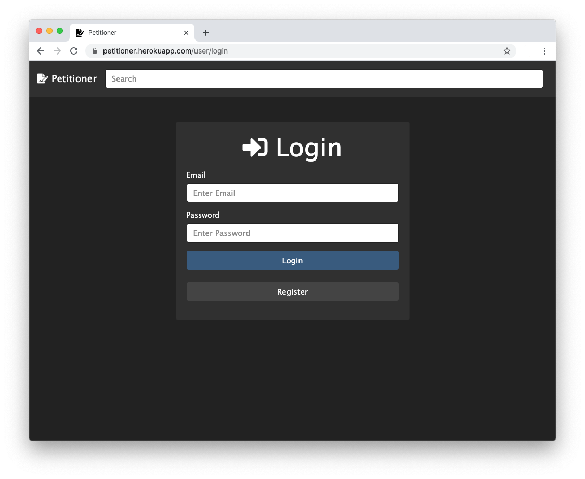
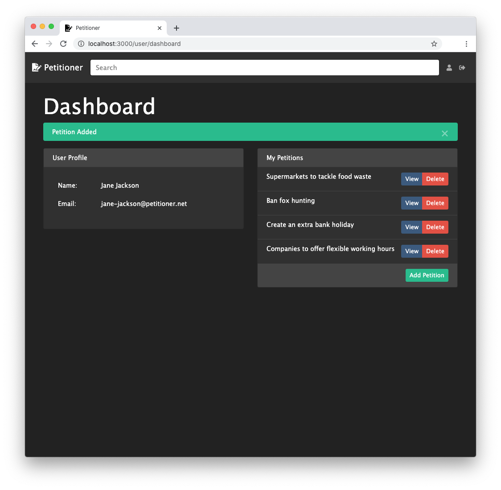
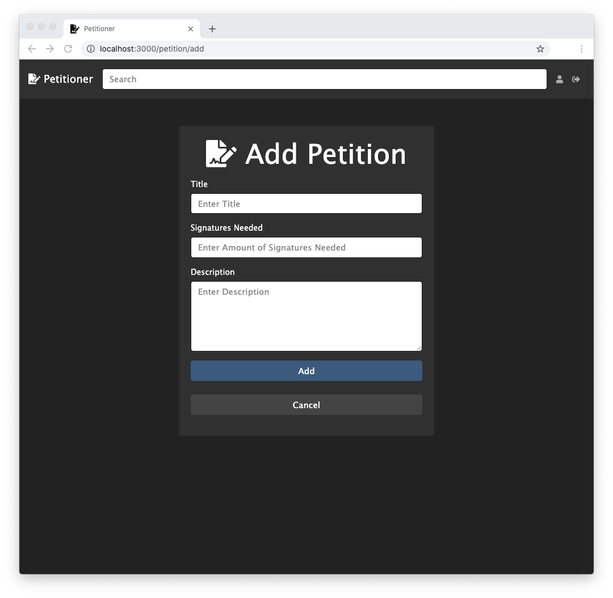
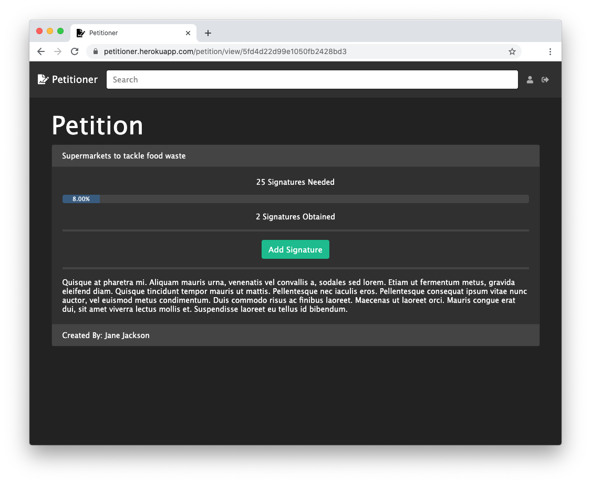

# Petitioner

Petition website using [Node.js](https://nodejs.org/), [Express](https://expressjs.com/), [Mongoose](https://mongoosejs.com/), [socket.io](https://socket.io/) and [EJS](https://ejs.co/).

Create online petitions which can be shared to or searched by millions across the world for them to sign, to help you with a cause or matter that is important to you.

#### Homepage
Main page with login/register window, below listing the 5 most recently added petitions and a search bar that uses ajax to search as the user types. 

#### Register
Once registered, the user will be redirected to the login page.

#### Login
Once logged in, the user will be redirected to their dashboard.

#### Dashboard
Once logged in, users will land at their dashboard, where they can view their details, along with managing their petitions.

#### Add Petition
When a petition has been added, it will be automatically signed by the created by user.

#### View Petition
When adding a signature, [socket.io](https://socket.io/) will update the signatures for all users without having to refresh, the button will then change to "Remove Signature", allowing the signature to be removed and then updated again for all users. 
